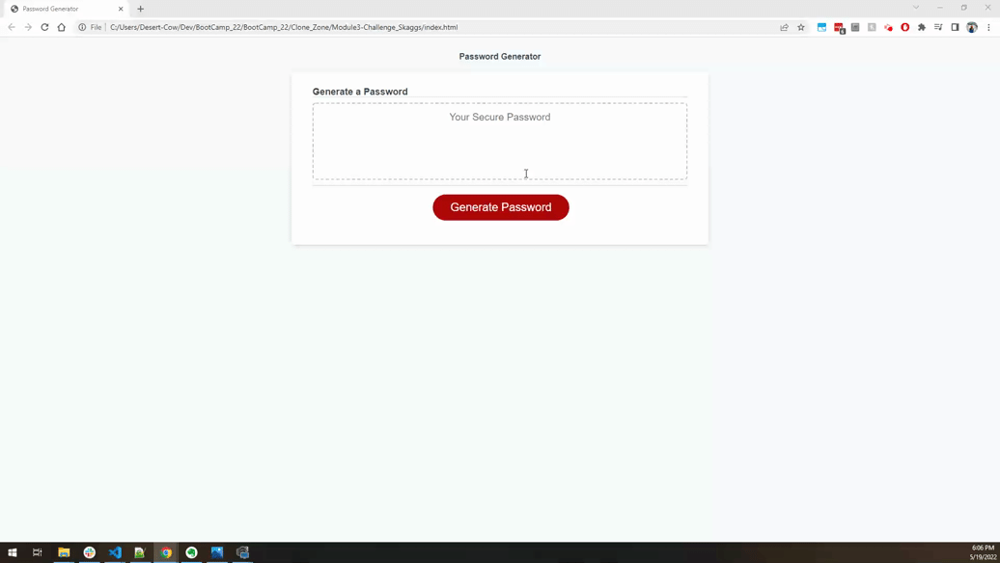

<h2 align="center">Password Generator Starter Code</h2>

---

<h5 align="center">

💼 Module 3 Challenge 💼 
By Clayton Skaggs 
(WW20.4) / May 19th 2022

Version 0.1</h5>

---
 
 

<h3 align="center">User Story</h3>

----

<b>AS AN</b> employee with access to sensitive data 
<b>I WANT</b> to randomly generate a password that meets certain criteria 
<b>SO THAT</b> I can create a strong password that provides greater security

 
 
 

<h3 align="center">Acceptance Criteria</h3>

---

🌟 🌟 <b>GIVEN</b> I need a new, secure password 🌟 🌟  

<b>WHEN</b> I click the button to generate a password 
❌ THEN I am presented with a series of prompts for password criteria 
<b>WHEN</b> prompted for password criteria 
❌ THEN I select which criteria to include in the password 
<b>WHEN</b> prompted for the length of the password 
❌ THEN I choose a length of at least 8 characters and no more than 128 characters 
<b>WHEN</b> asked for character types to include in the password 
❌ THEN I confirm whether or not to include lowercase, uppercase, numeric, and/or special characters 
<b>WHEN</b> I answer each prompt 
❌ THEN my input should be validated and at least one character type should be selected 
<b>WHEN</b> all prompts are answered 
❌ THEN a password is generated that matches the selected criteria 
<b>WHEN</b> the password is generated 
❌ THEN the password is either displayed in an alert or written to the page 

 
 
 

<h3 align="center">Mock Layout</h3>

---

 
 

<h3 align="center">Final Product GIF</h3>

---

 
 

<h3 align="center">Deployment Information</h3>

---

 
 

🚀 <a href="https://github.com/DesertCow/Module3-Challenge_Skaggs">github.com/DesertCow/Module3-Challenge_Skaggs</a> 🚀
 
 
🛰️ <a href="https://desertcow.github.io/Module3-Challenge_Skaggs">desertcow.github.io/Module3-Challenge_Skaggs/</a> 🛰️

---

 
 

